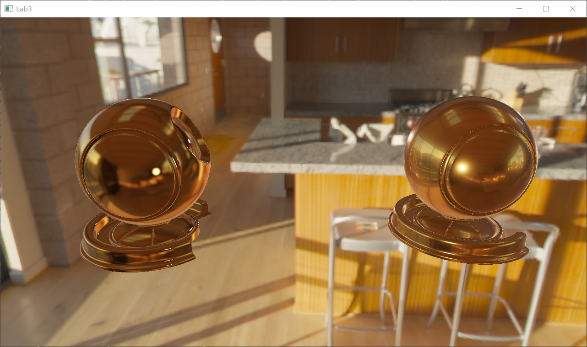

ShadingSandbox
=======================================

A simple OpenGL Render Engine for tutorial in Nanjing University SE《Computer Graphics》 course.  
Real-time render any scene from a config file.

features
---------------------------------------

basic shading  
merl brdf database sample  
pbr support  
image based lighting  

此项目是我在南京大学软件工程系担当《计算机图形学》课程助教时独立完成的渲染沙盒，基于OpenGL，其实主要工作是将《LearnOpenGL》系列博客里的技术进行了工程化（forward rendering，有支持IBL相关的prepass组件），可以从config文件里读取场景信息，根据指定的shader进行渲染。  

除了在github上做个存档外，项目里也把三次作业的文档（作业就是写shader了）放了进去，涉及Phong、merl采样、pbr、蒙特卡洛采样等内容，也许有教学意义（？）  

main.cpp从glad中加载opengl驱动，进行管线的初始化工作，并开始渲染循环，每次循环分为Draw()和Update()两步。除此之外也有一些对用户操作的处理。在初始化部分，需要手动更改代码里的pipeline实现类，在BasePipeline和IblPipeline间切换。  

SimplePipeline/IblPipeline代表渲染管线，前者的Init、Draw和Update都只是在Scene的Init、Draw和Update上包了一层，后者则支持IBL，初始化环境贴图的天空盒、镜面IBL和漫反射辐照的前置渲染pass，并在渲染循环中给shader引入所需的environmentMap和镜面IBL相关的预计算贴图和brdf LUT。  

Scene的Init()接口读取config.json文件，根据配置内容设置相机、场景内的物体材质信息、加载编译相应的shader等，并在Draw()接口中设置各个物体shader的uniform变量，进行绘制。  

Skybox的Init()接口则负责从hdr图片中捕获天空盒的cubemap，Draw()接口负责绘制。  

tools文件夹下的类都是管理贴图、shader、物体的mesh等资源的工具类，为了工程化独立出来的组件，可以只关注接口不关注实现。  

shader文件夹下给出了基于cook-torrance微表面模型的pbr实现，支持镜面ibl。  
